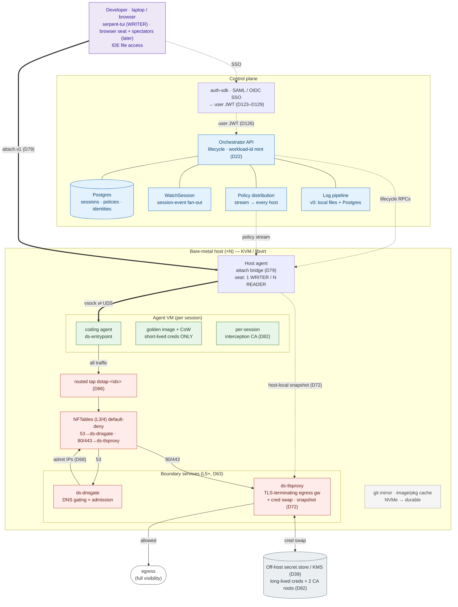

# Architecture

Dream Serpent runs coding agents in fast, throwaway VMs that feel local, with safety
guardrails built into the environment instead of bolted on after (D28). Isolation, network
policy, credential swap, and per-workload identity are a **property of the box**, not a
feature you turn on.

> **The thesis: constrain the box, not the model — and make the box the best place to work.**

You can't reliably constrain a model's behavior, but you can constrain the environment it
runs in — and if that environment is fast and pleasant, people use it instead of routing
around it. Two ideas carry the design:

- **Separate the agent from the human.** The agent gets its own identity and only
  short-lived credentials, and the controls live outside its reach (D8).
- **Make the separated path the convenient one.** Bare-metal speed, pre-baked images, and a
  thin-client feel — otherwise developers stay on their laptops, unconstrained.

Design decisions are cited by canonical ID — `D<number>`. Doc sections from the internal
design corpus are cited as `doc <NN> §<section>`; those citations are kept for provenance
and are not links.

---

## The shape in one breath

**Every agent session runs in its own throwaway virtual machine, that VM is treated as
already-compromised, a human drives it from the outside, and the only way it reaches the
network is through a wall it cannot touch.** Everything below is a consequence of those
four facts.

Each session gets a fresh KVM VM on a bare-metal host. The VM holds the agent and nothing
valuable — no long-lived credential ever lives inside it. Full VM isolation was chosen over
containers or gVisor on purpose (D1); KVM only, with no Firecracker or generic
multi-hypervisor layer (D30). The interesting design problem then becomes: how does the
human reach in to drive the agent, and how does the agent reach out to the network,
*without those two paths ever being the same path*?

## The three planes

**How the human drives the agent is never how the agent reaches the network.** One path for
driving, a separate path for egress — that single split is what the three planes are.

| Plane | What it carries | The path |
|---|---|---|
| **Attach** | A remote session's keyboard/screen I/O. | Human ⇄ host agent ⇄ VM, over a local socket pipe — **off** the egress dataplane. |
| **Egress dataplane** | Everything the agent sends to the network. | VM → its own tap → default-deny firewall → two Rust boundary services → internet. |
| **Control** | Session lifecycle and one versioned policy. | Control plane → every host. |

**Attach plane.** A remote session's stdin/stdout ride this path, deliberately kept *off*
the network-egress path. The handle is `attach.v1`; under the hood it bridges from the host
into the guest over a VM-to-host socket (`AF_VSOCK` ⇄ a per-session UDS), so no IP is
involved and the drive channel is sandboxed by construction (D79). The `serpent-tui`
terminal holds the single WRITER seat; a browser writer seat and read-only spectators are a
later milestone (D136/D137).

**Egress dataplane.** The VM sends all of its traffic to its own dedicated virtual interface
(a *tap*), the tap feeds a default-deny firewall, the firewall hands approved traffic to two
Rust boundary services, and only then does anything reach the internet.

**Control plane.** Starts and stops sessions and streams one versioned policy out to every
host, where each host keeps a local snapshot the boundary reads from (D72).

One fact underpins all three: a session is identified by *its own interface* — its tap —
never by source IP, because anything inside an untrusted VM can lie about its IP, but it
cannot forge which tap its packets arrive on (D44).

## The system, drawn

Three planes are distinguished by edge style: the **attach plane** (thick `===`, a remote
session's I/O, off the egress dataplane), the **egress dataplane** (solid), and **control /
proposed** paths (dashed).

**Green** = the untrusted agent. **Red** = the security boundary the agent cannot reach.
**Grey** = the off-host credential trust zone (D39). **Blue** = the control plane.

## The components

| Component | What it is | In-tree |
|---|---|---|
| **Developer client** | The human's seat. `serpent-tui` holds the live WRITER connection; a browser writer seat and read-only spectators arrive later. | [`client/`](../client/README.md), [`serpent-tui/`](../serpent-tui/README.md) |
| **Orchestrator API** | The Go control plane: session lifecycle, placement across hosts, and minting each session's short-lived workload identity. Two services plus `orchestrator-lite`, the single-host all-in-one (D35). | [`orchestrator/`](../orchestrator/README.md) |
| **Policy distribution** | Streams a single, monotonically-versioned policy to every host, which keeps its own local snapshot (D72). | [`dataplane/crates/ds-policy-snapshot/`](../dataplane/crates/ds-policy-snapshot/README.md) |
| **auth-sdk** *(SSO)* | Bridges enterprise SSO (SAML 2.0 / OIDC) into a short-lived user token, then attenuates it down to per-VM tokens (D123–D129). | [`identity/auth-sdk/`](../identity/auth-sdk/README.md) |
| **Host agent** | The per-host daemon. Drives the hypervisor, runs the attach bridge between client and VM, and applies the policy snapshots it receives. | [`orchestrator/`](../orchestrator/README.md), [`vm/`](../vm/README.md) |
| **Agent VM** | The untrusted per-session world: a golden image on a copy-on-write disk, carrying only short-lived credentials. `ds-entrypoint` boots the agent inside it (D38). | [`vm/entrypoint/`](../vm/entrypoint/README.md), [`images/golden/`](../images/golden/README.md) |
| **NFTables** (L3/4) | The default-deny firewall. Redirects DNS to `ds-dnsgate` and HTTP(S) to `ds-tlsproxy`, holds the IP allow-sets that DNS gating fills in, and drops everything else. | [`dataplane/crates/ds-nft/`](../dataplane/crates/ds-nft/README.md) |
| **ds-dnsgate** | The DNS gate. Decides each name against policy and admits the resolved IPs to the firewall *before* it answers — fail-closed by design. | [`dataplane/services/ds-dnsgate/`](../dataplane/services/ds-dnsgate/README.md) |
| **ds-tlsproxy** | The TLS-terminating egress gateway. Inspects HTTP(S), swaps the agent's short-lived credential for the real one at the edge, and logs every flow. | [`dataplane/services/ds-tlsproxy/`](../dataplane/services/ds-tlsproxy/README.md) |
| **ds-flowlog** | The independent network-flow ledger that cross-checks the proxy's own record of what left the box. | [`dataplane/services/ds-flowlog/`](../dataplane/services/ds-flowlog/README.md) |
| **Local cache** | A host-local git mirror plus image/package cache on fast local disk. Keeps routine fetches off the egress path (D41). | [`images/cache/`](../images/cache/README.md), [`images/mirror/`](../images/mirror/README.md) |
| **Secret store / KMS** | An off-host store in a separate trust zone, holding the long-lived credentials and the CA roots. The agent can never reach it (D39). | [`identity/`](../identity/README.md) |

**The boundary is not one binary.** It is two Rust services — `ds-dnsgate` and
`ds-tlsproxy` — *plus* the NFTables firewall, designed as independent failure domains so DNS
can keep answering while the HTTP path is being deployed (D63). All of it lives in one Rust
workspace ([`dataplane/`](../dataplane/README.md)); a third service (`ds-flowlog`) and
several shared crates round it out.

---

# Security model

## The one idea

We run an agent inside a virtual machine, and we treat that VM as already compromised. We
don't trust the model, the code it runs, or anything else inside the VM. Three structural
moves make this safe:

1. **The VM is untrusted.** It holds the agent and nothing valuable.
2. **The boundary is unreachable.** Everything the agent sends to the network crosses
   services it can't touch or edit (D16).
3. **The real secrets live off-host.** Long-lived credentials and the CA roots sit in a
   separate store the agent can never reach (D39).

We are **not** trying to stop every bad action. Some will happen; an agent can be tricked,
and a dependency can be poisoned. What we guarantee instead is two things:

- **Bounded blast radius.** A compromised agent can only reach places that were explicitly
  approved, and it never holds a real credential.
- **Attribution.** Every action ties back to the human who launched the session. — D8

## Who we're defending against

The single idea behind all five adversaries: **the environment bounds the agent, not the
model.** We never rely on the model behaving well.

| Adversary | The threat | Why the environment contains it |
|---|---|---|
| **Malicious dependency** | A poisoned npm or pip package runs with the agent's full powers. | It can still only reach approved domains, and it never sees a real credential. |
| **Prompt-injected agent** | A hostile instruction makes the *model itself* untrustworthy. | So scanning the model's own calls can't be the primary defense — the boundary is. |
| **Compromised laptop** | The developer's machine is breached. | The laptop holds only a thin client and a short-lived attach ticket. Agent credentials were never there to steal. |
| **Malicious insider** | A trusted operator abuses their access. | Here we can't prevent — so we make everything auditable: an append-only policy log, plus per-action attribution to a named human. |
| **Curious agent** | Not hacked, just over-eager and poking at things. | Default-deny plus fast, machine-readable denials turn poking around into logged dead-ends instead of damage. |

Scanning the model's own API calls is explicitly *rejected* as the primary control: it is
latency-bound and probabilistic, not a real boundary. Call *capture* is kept for audit — it
informs, it never gates. — D9

## The network boundary, in four layers

### 1. The firewall — block everything by default

**Threat:** an agent with network access can reach anything on the internet. **Defense:** a
firewall (NFTables) that drops all traffic except two redirects — DNS goes to `ds-dnsgate`,
and web traffic (ports 80 and 443) goes to `ds-tlsproxy`. Everything else is dropped. — D4

Two details matter. First, the firewall identifies a session by its **own network
interface** — a dedicated virtual NIC, its *tap* — never by source IP, because anything
inside the VM can lie about its IP (D44). Second, QUIC (UDP 443) is actively **rejected**,
not silently dropped, so the agent falls back to plain TCP the proxy can actually inspect
(doc 12 §7).

### 2. The DNS gate — decide which names an agent may reach

**Threat:** if the agent could resolve any name and connect to the result, the firewall's
allow-list would mean nothing. **Defense:** the agent can't talk to a resolver directly.
Every name lookup is redirected to `ds-dnsgate`, which decides **allow, deny, or ask** for
each name.

The clever part is the ordering. When a name is allowed, `ds-dnsgate` opens the firewall for
the resolved IP addresses **before** it hands the DNS answer back. So a connection can never
beat its own permission. (This shared list of approved IPs is the *admission map*:
`ds-dnsgate` is the only writer; the TLS proxy only reads it.)

If anything goes wrong at any step, the gate returns a DNS error — never an unguarded IP.
That is what **fail closed** means here. Denials are machine-readable too: a hard block
returns `NXDOMAIN` with a "blocked by policy" reason (EDE 15), and an "ask" returns
`REFUSED`, so the agent reacts instead of hanging. — D68, D71

### 3. The TLS proxy — see every call and swap in the real credential

**Threat:** the agent's HTTPS is encrypted, so we'd be blind to what it sends — and it would
carry real credentials it could exfiltrate. **Defense:** `ds-tlsproxy` terminates the
agent's HTTPS at the edge, inspects it, and swaps the credential, all outside the VM.

To read encrypted HTTPS, the proxy uses a per-session *interception CA* whose root is
pre-installed in the VM's trust store before boot — or boot fails (D17). That lets
`ds-tlsproxy` present a certificate the agent trusts, so it can terminate the agent's HTTPS
at the edge. Once it has the plaintext request it does three things:

1. **Verifies the destination.** It recovers the true target from the kernel (the agent
   can't fake it) and re-checks it against the admission map. A connection that didn't go
   through the redirect, or that points somewhere unapproved, is refused (D68/D69).
2. **Inspects and swaps.** It logs the call, then replaces the agent's placeholder
   credential with the real long-lived secret fetched from the off-host store (D83).
3. **Re-originates.** It opens its **own** brand-new HTTPS connection to the real upstream —
   this time doing full, strict certificate validation — and forwards the request. The agent
   delegated its trust to the proxy; the proxy does the real checking. — D76

### 4. Policy — one ruleset, pushed live everywhere

**Threat:** a host running an old or missing ruleset is a hole. **Defense:** there is exactly
**one** versioned ruleset, streamed live to every host. A host with stale policy is
unschedulable, and a freshly-booted host serves nothing but default-deny until it has a
verified ruleset.

The policy is a single typed schema with five guardrail classes — egress, rate, quota,
content, and credential — and deliberately **no expression language or judge models** in v0.
An append-only log gives every policy change a total order for auditing. — D52

## Identity and the credential swap

**Threat:** if a real, long-lived credential ever sat inside the VM, a compromised agent
would steal it — and you'd have to rotate it. **Defense:** the real credential never enters
the VM. This is the payoff that makes "treat the VM as compromised" actually safe: **there
is nothing in the VM worth stealing.**

- **Every session gets its own short-lived identity.** At session start it is issued an
  X.509 certificate with a SPIFFE-style name plus a matching token, valid only for the life
  of that session and tied to the human who launched it. That is how every action gets
  attributed to a named person. — D22
- **The real secret is swapped in outside the VM.** Inside the VM the agent carries only a
  *placeholder*. When it calls an API, `ds-tlsproxy` validates the placeholder, fetches the
  real secret from the off-host store, and substitutes it into the outgoing request — at the
  edge, outside the VM. The real secret never enters the VM and is scrubbed from every
  log. — D83
- **Three separate key hierarchies.** The workload identity, the interception CA, and
  user-auth each have their own signing roots, so a signature minted for one purpose can
  never be replayed as another. Both CA roots live off-host. — D82
- **Scoped per-subagent tokens.** A session's base token can be narrowed *offline* into
  strictly weaker child tokens — one per sub-agent — without a round-trip to the server
  (built on Biscuit). The contract for minting the base token is frozen; live enforcement of
  grant-narrowing rides the swap path. — D98, D125–D129

## The enforcement ladder

For a request we don't recognize, the response is one of four fixed rungs, governed by one
rule: **interrupt a human only to grant new authority or stop something irreversible — never
to review work.**

1. **allow + log** — known-good, recorded.
2. **block + log** — the default for a behavioral cap. The agent gets an in-band failure (an
   `NXDOMAIN`, a `403`, a `429`) and self-heals.
3. **suspend + ask** — reserved for real threats. An unknown domain gets a brief socket-hold
   (~30–60 s) while an attended human decides; with nobody watching, it downgrades to block
   + log.
4. **kill + snapshot** — for an irreversible action.

— D53, D77. The approval surface lives in the client, never in the proxy (D18/D45).

## What the guardrails claim — and don't

This is a productivity platform whose guardrails are a built-in property, not a security
product with an attack catalog. So safety is stated as **testable claims**, shipped as a
versioned package anyone can run against their own deployment (D51). Per-PR scope is
fail-closed: a code path not mapped to a guardrail runs the full matrix (D47).

| # | Claim |
|---|---|
| 1 | **The resolver holds as a unit** — DNS is the only resolution path, encrypted-DNS bypasses are closed, private-range answers are never admitted, and allow-sets expire. |
| 2 | **Every flow is attributed** — the proxy is the system of record, cross-checked by an independent network-flow ledger. |
| 3 | **Full-visibility egress by default** — every non-pinned flow is inspected, logged, and credential-swapped; the pass-through exception ships empty. |
| 4 | **A planted canary credential never leaks** — on inspected egress paths. |
| 5 | **A confused-deputy bug is contained** — an SSRF-shaped flaw reaches only already-approved public IPs, never internal targets. |

**What is explicitly *not* claimed:**

- Pass-through flows (cert-pinned clients we can't decrypt) are **not** inspected or
  credential-swapped. That list ships empty, and entries require evidence.
- The secret-egress gate stops accidents and casual exfiltration — it is **not** a
  cryptographic boundary. A determined adversary using clever encodings can defeat it.
- Some credentials are *injected* into the VM by design (bounded by short TTLs and a record
  of what was issued) — a different, weaker promise than the swap.
- A **fully compromised proxy** holds live swap material. We contain bugs, not a total
  takeover of the boundary itself.
- **Sessions are lost on host failure** in v0 — there is no durability claim yet.

## What audit trail one request leaves

- *What it wrote* — every block the VM writes lands in its own copy-on-write disk overlay,
  inspectable from the host (D29).
- *Where it talked* — per-flow netflow records at NFTables, plus a DNS event for every name
  resolved (D43).
- *What it sent* — `ds-tlsproxy` logs the domain, session, identity, bytes, duration, and
  HTTP metadata of every egress call, plus one credential-use record (D43/D83).
- *What it intended* — prompts and plans land in queryable Postgres (D6/D36).

---

## Built vs. designed

Be honest about what runs today versus what is designed behind frozen contracts.

- **The attach path is live, at a validation posture.** A real coding agent has been driven
  inside a rootless KVM VM over `attach.v1` — completing a real turn *and* a driven tool
  call. But this runs without the production safety wiring: egress goes out directly, and
  the operator's own token is injected into the VM.
- **The egress boundary is built behind frozen contracts, not yet live.** The firewall
  encoder (`ds-nft`) is real and live-validated on hardware. The DNS gate's
  admit-before-answer transaction has landed, still as a pre-stage. `ds-tlsproxy`'s
  credential swap is built and tested end to end *over fakes* — validate the placeholder,
  fetch, substitute the `Authorization` header, emit exactly one credential-use record, with
  the secret held in zeroizing types so "never log it" is structural. What is not yet live is
  narrower: the off-host store is a host-local file stand-in, and the byte splice is a no-op
  seam.

Production gated egress with the real credential swap is a **separate, later phase** — not
today's path. **Treat the safety properties above as the design, not a live production
claim.**

## Milestone bands

Capability bands, not sequential gates (D14).

| Band | Capability |
|---|---|
| **M0** | Walking skeleton: one VM, terminal attach, default-deny already active |
| **M1** | Trustworthy boundary + credential swap — run agents unattended |
| **M2** | Golden images, seconds-to-start, web client |
| **M3** | Fleet & scale: multi-host scheduling, subagent fan-out into own VMs |
| **M4** | Persistent agents on sensitive data |

## Where to go next

- [Development notes](development.md) — repo layout, build and test commands, the contract
  and testing rules.
- Per-tree READMEs — each states its charter, owner, and governing D-numbers:
  [`dataplane/`](../dataplane/README.md), [`orchestrator/`](../orchestrator/README.md),
  [`client/`](../client/README.md), [`vm/`](../vm/README.md),
  [`identity/`](../identity/README.md), [`proto/`](../proto/README.md),
  [`assurance/`](../assurance/README.md), [`boundary/`](../boundary/README.md).
